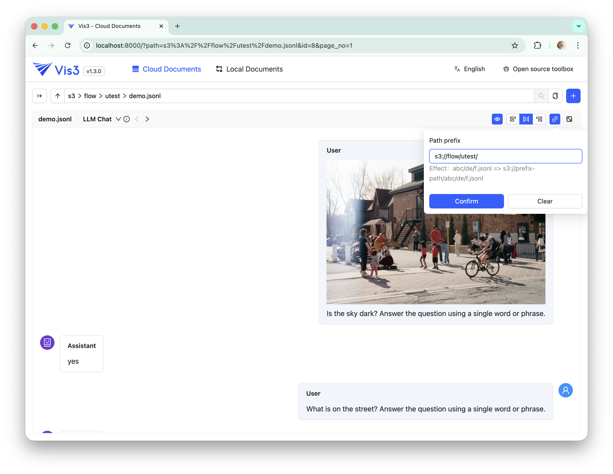
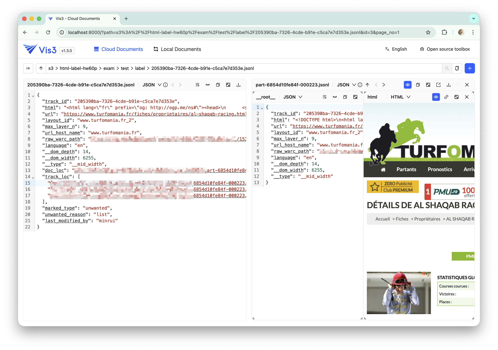
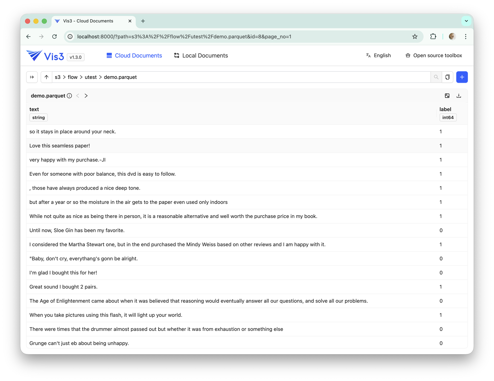
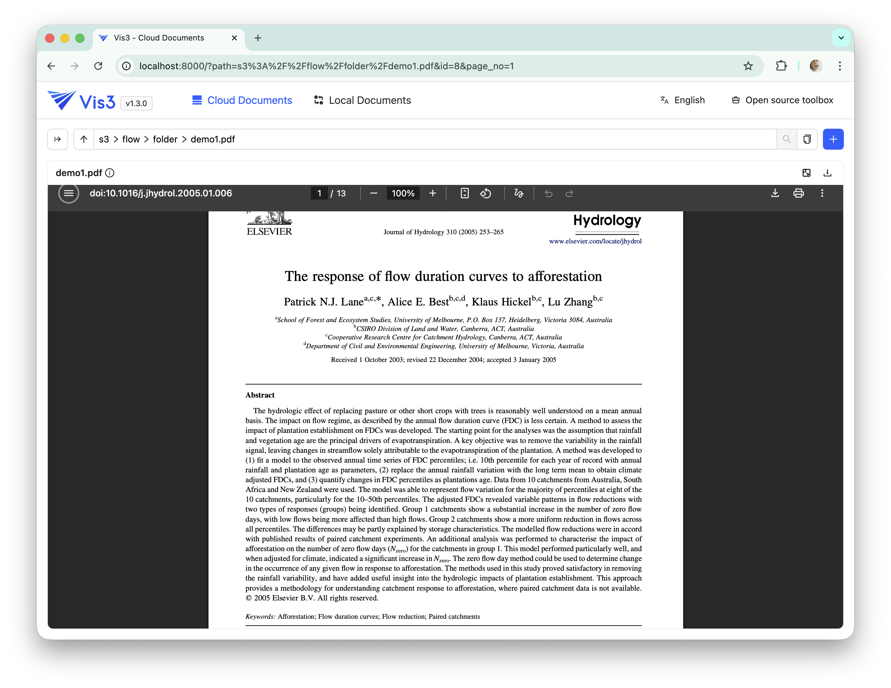
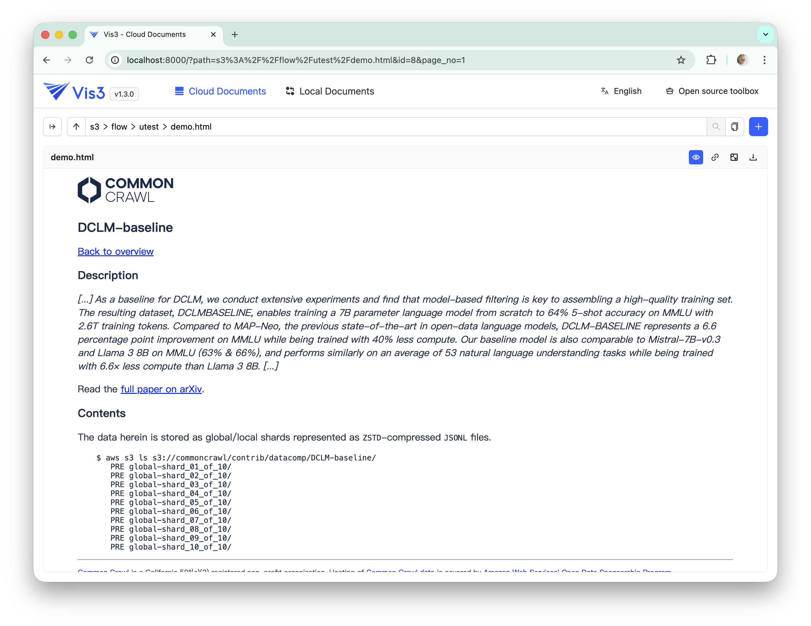
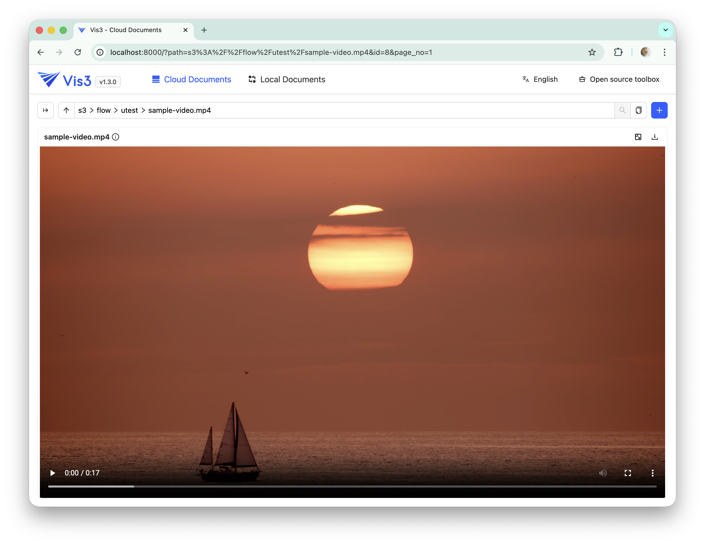
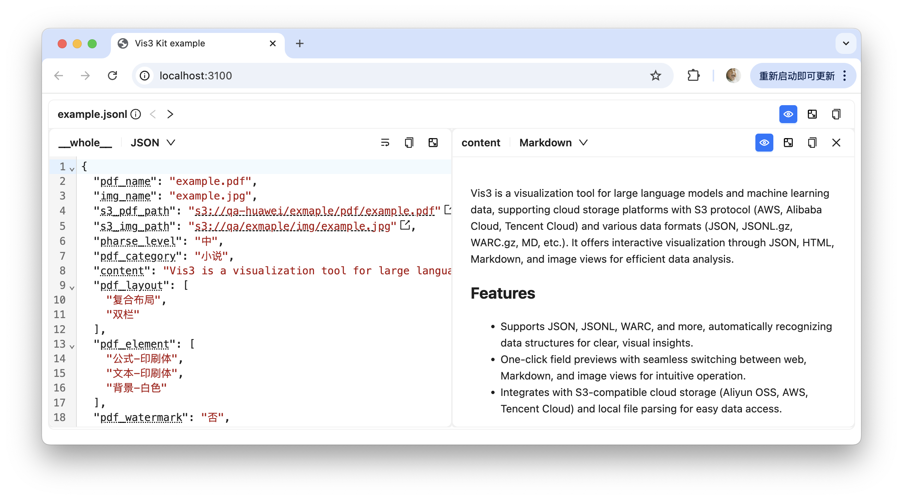

<div align="center">
  <article style="display: flex; flex-direction: column; align-items: center; justify-content: center;">
    <p align="center"></p>
    <h1 style="width: 100%; text-align: center;"></h1>
    <p align="center">
        简体中文 | <a href="./README.md" >English</a>
    </p>
  </article>
</div>

> 基于 s3 的 OSS Browser

一款为大模型和机器学习设计的数据可视化工具。支持主流云存储平台（阿里云、AWS等S3协议），兼容多种数据格式（json、jsonl.gz、warc.gz、md 等）。通过交互式可视化提供JSON、网页、Markdown、图片等多种视图模式，让数据分析更高效。

## 特性

- 支持 JSON、JSONL、WARC 等多种格式，智能识别数据结构并可视化呈现关键信息，让数据一目了然。

- 一键预览任意字段，支持网页、Markdown、图片等多种视图模式自由切换，操作简单直观。

- 无缝对接主流云存储平台（阿里云、AWS、腾讯云等支持S3协议的云存储平台），支持本地文件解析，轻松实现数据接入。

https://github.com/user-attachments/assets/aa8ee5e8-c6d3-4b20-ae9d-2ceeb2eb2c41

## Screenshots

- File list

- llm chat

- JSONL / JSON

- Parquet

- PDF

- HTML

- Video


## 开始使用

```bash
# python >= 3.9.2
pip install vis3
```

或者使用 conda 创建 python 环境：

> 安装 [miniconda](https://docs.conda.io/en/latest/miniconda.html)

```bash
# 1. 使用conda创建python3.11环境
conda create -n vis3 python=3.11

# 2. 激活环境
conda activate vis3

# 3. 安装 vis3
pip install vis3

# 4. 启动
vis3 --open

```

### 更新到最新版本

```bash
pip install vis3 -U
```

## 环境变量设置

### `ENABLE_AUTH`

开启用户登录鉴权

```bash
ENABLE_AUTH=1 vis3
```

### `BASE_DATA_DIR`

指定数据库文件（SQLite）目录

```bash
BASE_DATA_DIR=your/database/path vis3
```

### `BASE_URL`

指定应用的资源 base 路径，影响 `/api` 路径。

```bash
BASE_URL=/a/b/c
```

## 本地开发

```bash
conda create -n vis3-dev python=3.11

# 激活虚拟环境
conda activate vis3-dev

# 安装 peotry
# https://python-poetry.org/docs/#installing-with-the-official-installer

# 安装python依赖
poetry install

# 安装前端依赖（安装pnpm： https://pnpm.io/installation）
cd web && pnpm install

# 构建前端产物 (web目录下)
pnpm build

# 启动 vis3
uvicorn vis3.main:app --reload
```

## React Component

我们通过 npm 提供了[React 组件](./web/packages/vis3-kit/)，方便自定义数据预览界面或者接入已有的 React 应用。



```bash
npm i @vis3/kit
```

## 技术交流

欢迎加入 Opendatalab 官方微信群！

<p align="center">

</p>

## 友情链接

- [LabelU](https://github.com/opendatalab/labelU) 音视频、图像标注工具
- [LabelU-kit](https://github.com/opendatalab/labelU-Kit) Web 前端标注套件（LabelU基于此套件开发）
- [LabelLLM](https://github.com/opendatalab/LabelLLM) 开源LLM对话标注平台
- [Miner U](https://github.com/opendatalab/MinerU) 一站式高质量数据提取工具

## 开源许可证

该项目使用 [Apache 2.0 license](./LICENSE).
